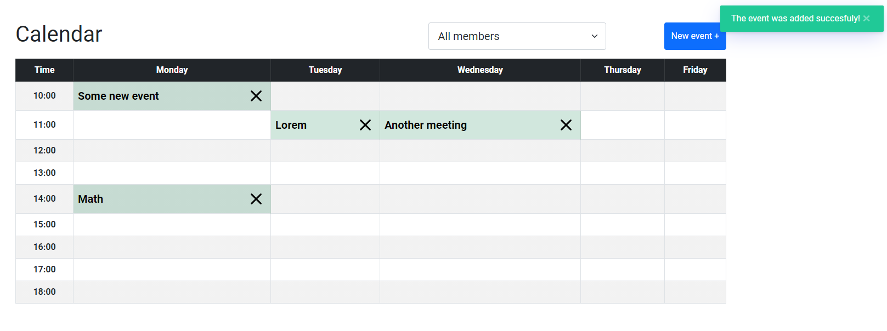
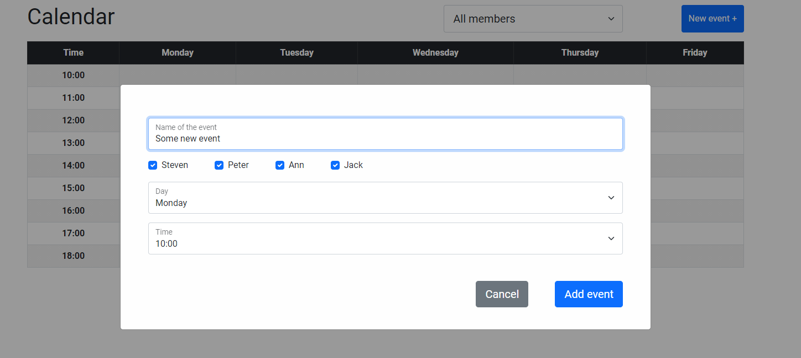
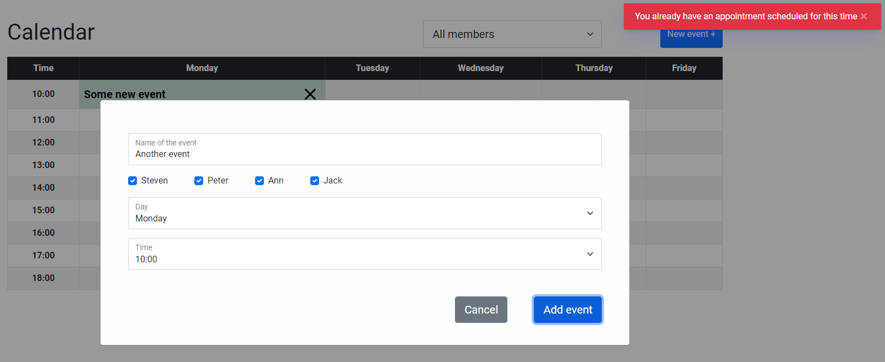

# Calendar

> A simple meeting planning calendar for a meeting room.

## Table of contents
* [General info](#general-info)
* [Screenshots](#screenshots)
* [Technologies](#technologies)
* [Setup](#setup)
* [Features](#features)
* [Status](#status)
* [Inspiration](#inspiration)

## General info

  - Display meetings planned;
  - Filter meetings for a particular team member;
  - Add new meetings;
  - Delete meetings;

## Screenshots

## Technologies
* Bootstrap v5.0.0-beta1 (https://getbootstrap.com/)
* Pure JavaScript (ES6, ES next) with Babel transpiler 
* Scss
* Webpack as a module bundler

## Setup
Take a look at the [GitHub Pages](https://ic3top.github.io/Calendar-for-Ciklum/dist/)

## Features
###### List of features ready and TODOs for future development
* Display meetings planned
* Filter meetings for a particular team member _(the list of team member is hardcoded)_
* Toast messages (appear on errors and success)
* Add new meetings
* Delete meetings
* Meetings are saved in local storage

###### To-do list:
* Custom confirmation window on deleting (instead confirm function)
* Dark theme
* Drag and drop technique on “Calendar” view
* Event description on hover

## Status
Project is: _in progress_ (require some improvements)

## Inspiration
Created to pass entry exams of Ciklum JavaScript Internship program.
